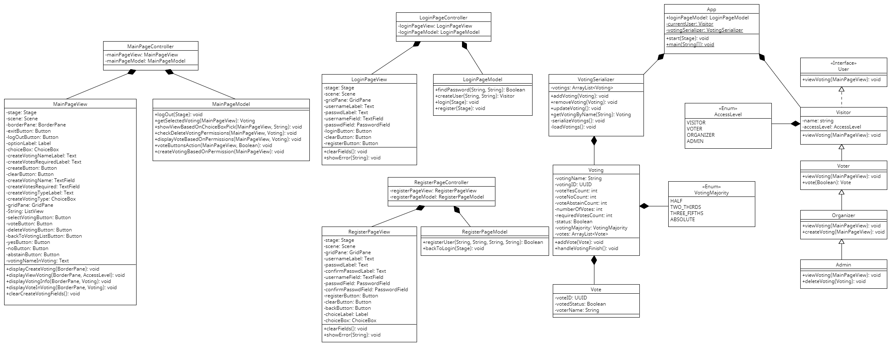

# Objektovo orientované programovanie
## Semestrálny projekt - YourVoteMatters
##### (Aplikácie pre hlasovania v mestskom zastupiteľstve)
###### Autor: Marek Čederle


### Použité nástroje
- IntelliJ IDEA Ultimate 2024.1.1
- Java 21 (OpenJDK 21.0.1)
- JavaFX 21.0.2 (Pomocou maven dependency, projekt bol vytvorený ako JavaFX projekt v IntelliJ IDEA)
- Online nástroj [UMLetino](https://www.umletino.com/umletino.html) na tvorbu diagramu tried


### Zámer projektu
Cieľom aplikácie bude uľahčiť a zefektívniť proces hlasovania v mestskom zastupiteľstve. Aplikácia poskytne poslancom mestského zastupiteľstva možnosť elektronicky hlasovať pri rozhodovaní o rôznych záležitostiach, ktoré ovplyvňujú ich mesto a komunitu.

Používatelia budú mať možnosť prihlásiť sa do systému a hlasovať elektronicky cez aplikáciu. Bude sa tam nachádzať hierarchia používateľov od admina cez organizátora a hlasovača až po návštevníka. Organizátor bude môcť zvoliť medzi rôznymi typmi hlasovania (nadpolovičná väčšina – jednoduchá/absolútna, 3/5 väčšina, 2/3 väčšina).

Cieľom projektu je zvýšiť zapojenie občanov do rozhodovacích procesov a zvýšiť transparentnosť a demokratickosť pri riadení mesta prostredníctvom moderných technologických riešení.


### Diagram tried
Pre zjednodušenie boli vynechané get a set metódy a konštruktory tried.


#### Popis tried a vzťahov
Vzťahy medzi triedami sú znázornené na diagrame tried. Máme rozhranie `User`, ktoré definuje základnú metódu pre používateľa. Následne máme triedu `Visitor`, ktorá implementuje toto rozhranie. Ďaľej máme triedy `Voter`, `Organizer` a `Admin`, ktoré dedia hierarchicky od seba počnúc triedou `Visitor`. Tieto triedy obsahujú atribút `accessLevel`, ktorý je reprezentovaný enumom `AccessLevel`.

Trieda `App` obsahuje používateľa, ktorý je representovaný triedou `Visitor`, kde sa potom uplatňuje polymorfné správanie. Taktiež obsahuje triedu `VotingSerializer`, ktorá sa stará o serializáciu a deserializáciu hlasovaní. Táto trieda obsahuje aj triedu `Voting`, ktorá obsahuje zoznam hlasov. Trieda `Voting` obsahuje triedu `Vote`, ktorá obsahuje informácie o jednotlivých hlasoch v hlasovaní a taktiež enum `VotingMajority`, ktorý reprezentuje aký počet hlasov je potrebný pre schválenie hlasovania.

Následne máme triedy pre vzor MVC (Model-View-Controller), ktoré sú rozdelené do balíkov `Model`, `View` a `Controller` pre jednotlivé stránky aplikácie (LoginPage, MainPage, RegisterPage).

Triedy controller obsahujú objekty modelu a view, ktoré sú potom použité na spracovanie udalostí a zobrazenie informácií na obrazovke. Triedy modelu obsahujú logiku aplikácie a triedy view obsahujú grafické komponenty, ktoré sú zobrazené na obrazovke.

V tejto časti budú iba v skratke vysvetlené triedy, pretože všetky metódy a atribúty sú zobrazené v diagrame tried a podrobnejšie vysvetlené v javadoc.

##### AccessLevel (Enum)
Táto trieda slúži na reprezentáciu úrovne prístupu používateľa v systéme. Môže nadobúdať hodnoty VISITOR, VOTER, ORGANIZER alebo ADMIN.
##### Admin
Trieda reprezentujúca používateľa s najvyššími oprávneniami v systéme. Môže vytvárať nové hlasovania, zmazať hlasovania, hlasovať a zobraziť informácie o hlasovaniach.
##### App
Hlavná trieda aplikácie, ktorá spúšťa celý program. Taktiež sa stará o spustenie GUI.
##### Organizer
Táto trieda reprezentuje organizátora hlasovania. Môže vytvárať nové hlasovania, zobrazovať hlasovania, hlasovať a zobrazovať informácie o hlasovaní.
##### User
Rozhranie, ktoré definuje základnú metódu pre používateľa. Touto metódou je `viewVoting`, ktorá zobrazuje informácie o hlasovaní.
##### Visitor
Táto trieda reprezentuje návštevníka, ktorý nemá žiadne špeciálne oprávnenia. Môže zobraziť informácie o hlasovaní.
##### Vote
Trieda reprezentujúca hlas v hlasovaní. Obsahuje informácie o hlasujúcom a jeho hlasovaní.
##### Voter
Trieda reprezentujúca hlasujúceho. Môže zobraziť informácie o hlasovaní a hlasovať v ňom.
##### Voting
Trieda reprezentujúca hlasovanie. Obsahuje zoznam hlasov a informácie o hlasovaní.
##### VotingMajority (Enum)
Táto trieda reprezentuje počet hlasov potrebných pre schválenie hlasovania. Definuje nadpolovičnú väčšinu, 3/5 väčšinu a 2/3 väčšinu a absolútnu väčšinu.
##### VotingSerializer
Trieda, ktorá sa stará o serializáciu a deserializáciu hlasovaní.
#### MVC - Model-View-Controller
##### Model - LoginPageModel, MainPageModel, RegisterPageModel
Triedy, ktoré sa zaoberajú aplikačnou logikou. Obsahujú metódy, ktoré vykonávajú operácie nad dátami a zabezpečujú správne fungovanie aplikácie.
##### View - LoginPageView, MainPageView, RegisterPageView
Triedy, ktoré sa zaoberajú grafickým rozhraním aplikácie. Obsahujú grafické komponenty, ktoré sú zobrazené na obrazovke.
##### Controller - LoginPageController, MainPageController, RegisterPageController
Triedy, ktoré spracovávajú udalosti a zabezpečujú komunikáciu medzi modelom a view. Obsahujú tzv. `event handlers`, ktoré sa spúšťajú pri interakcii s grafickými komponentami.


### Splnenie hlavných kritérií
- [x] Dedenie (Inheritance)
- [x] Prekonávanie metód (Override)
- [x] Zapúzdrenie (Encapsulation)
- [x] Polymorfizmus (Polymorphism)
- [x] Agregácia (Aggregation)

#### Dedenie
V mojom projekte používam hierarchiu dedenia pre rôzne typy používateľov, ktorým sa stupňujú oprávenia.

```java
public class Visitor implements User{}

public class Voter extends Visitor{}

public class Organizer extends Voter{}

public class Admin extends Organizer{}
```

#### Prekonávanie metód
Viacej krát prekonávam metódu `viewVoting` z dôvodu, aby som ju mohol zavolať s vyššími oprávneniami, ktorá potom zobrazuje rôzne možnosti na základe oprávnení.

Príklad:
```java
public class Admin extends Organizer {
    //...
    @Override
    public void viewVoting(MainPageView mainPageView){
        mainPageView.displayViewVoting(mainPageView.getBorderPane(), AccessLevel.ADMIN);
    }
}
```

#### Zapúzdrenie
Zapúzdrenie používam v mojom projekte v podstate skoro všade, kde je to možné. Z tohto dôvodu používam `get` a `set` metódy pre prístup ku zapúzdreným atribútom triedy.

Príklad:
```java
public class Vote implements Serializable {
    private UUID voteID;
    private Boolean votedStatus;
    private String voterName;
    //...
    public UUID getVoteID() {
        return voteID;
    }
    public Boolean getVotedStatus() {
        return votedStatus;
    }
    public String getVoterName() {
        return voterName;
    }
}
```

#### Polymorfizmus
V mojom projekte používam polymorfizmus v metóde `createUser`, ktorá vytvára nového používateľa podľa jeho typu na základe zadaného levelu prístupu. Vráti objekt typu `Visitor`, ktorý je základným typom pre všetky nadradené typy používateľov.

Príklad:
```java
public class LoginPageModel {
    //...
    public Boolean findPassword(String username, String password){
        //...
        Visitor user = createUser(username, parts[2]);
        //...
    }
    //...
    public Visitor createUser(String name, String typeOfAccess){
        return switch (typeOfAccess) {
            case "ADMIN" -> new Admin(name, AccessLevel.ADMIN);
            case "ORGANIZER" -> new Organizer(name, AccessLevel.ORGANIZER);
            case "VOTER" -> new Voter(name, AccessLevel.VOTER);
            case "VISITOR" -> new Visitor(name, AccessLevel.VISITOR);
            default -> null;
        };
    }
    //...
}
```

#### Agregácia
Trieda `Voting` obsahuje `ArrayList` typu `Vote`. Trieda `Vote` obsahuje informácie o jednotlivých hlasoch v hlasovaní. Trieda `Voting` obsahuje zoznam hlasov, ktoré boli odovzdané v rámci hlasovania. Veľká časť agregácie sa nachádza v triedach, ktoré sú spojené s GUI.

Príklad:
```java
public class Vote implements Serializable
{
    //...
}

public class Voting implements Serializable {
    //...
    private ArrayList<Vote> votes;
    //...
}
```


### Splnenie ďalších kritérií
- [x] Použitie návrhových vzorov okrem návrhového vzoru Singleton
- [ ] Ošetrenie mimoriadnych stavov prostredníctvom vlastných výnimiek
- [x] Poskytnutie grafického používateľského rozhrania oddelene od aplikačnej logiky a s aspoň časťou spracovateľov udalostí vytvorenou manuálne
- [x] Explicitné použitie viacniťovosti (multithreading)
- [ ] Použitie generickosti vo vlastných triedach
- [x] Explicitné použitie RTTI
- [x] Použitie vhniezdených tried a rozhraní
- [x] Použitie lambda výrazov alebo referencií na metódy
- [ ] Použitie implicitnej implementácie metód v rozhraniach
- [ ] Použitie aspektovo-orientovaného programovania (AspectJ)
- [x] Použitie serializácie

#### Použitie návrhových vzorov
Ako bolo už viacej krát spomenuté v predchádzajúcich častiach, v mojom projekte používam vzor MVC (Model-View-Controller pattern). Tento vzor je použitý pre jednotlivé stránky aplikácie (LoginPage, MainPage, RegisterPage). Jeho úlohou je oddelenie aplikačnej logiky od grafického rozhrania a spracovanie udalostí.

Príklad z triedy `MainPageController`:
```java
public class MainPageController {
    private MainPageView mainPageView;
    private MainPageModel mainPageModel;
    //...
}
```

#### Oddelenie grafického používateľského rozhrania od aplikačnej logiky
Oddelenie grafického používateľského rozhrania od aplikačnej logiky vyplýva z použitia vzoru [MVC](#použitie-návrhových-vzorov). Triedy modelu obsahujú logiku aplikácie, triedy view obsahujú grafické komponenty a triedy controller spracovávajú udalosti a zabezpečujú komunikáciu medzi modelom a view.

Celá grafická časť aplikácie je vytvorená manuálne pomocou JavaFX bez použitia `fxml` súborov alebo programu `SceneBuilder`.

#### Explicitné použitie viacniťovosti (MultiThreading)
Viacniťovosť je použitá v mojom projekte v triede `VotingSerializer`, ktorá sa stará o serializáciu a deserializáciu hlasovaní. Pri serializácii je vždy vytvorené nové vlákno, ktoré sa spustí paralelne ku hlavnému vláknu aplikácie. Tým pádom ak máme veľa dát, ktoré treba serializovať, tak sa to vykonáva "na pozadí" a neblokuje hlavné vlákno aplikácie.
```java
public class VotingSerializer {
    //...
    private void serializeVotings() {
        new Thread(() -> {
            try {
                FileOutputStream fileOut = new FileOutputStream("resources/votings.ser");
                ObjectOutputStream out = new ObjectOutputStream(fileOut);
                out.writeObject(votings);
                out.close();
                fileOut.close();
            } catch (IOException i) {
                i.printStackTrace();
            }
            System.out.println("Votings serialized in thread !");
        }).start();
    }
    //...
}
```

#### Použitie RTTI (Run-Time Type Identification)
Vo svojom programe používam `instanceof` operátor na zistenie typu objektu a následne vykonanie príslušnej akcie. Tento operátor je použitý napríklad v metóde `checkDeleteVotingPermissions` v triede `MainPageModel`, kde sa kontroluje, či je používateľ typu `Admin` a ak áno, tak môže zmazať hlasovanie.
```java
public class MainPageModel {
    //...
    public void checkDeleteVotingPermissions(MainPageView mainPageView, Voting local_voting){
        if (local_voting == null) {
            return;
        }
        System.out.println("Selected voting: " + local_voting.getVotingName());

        if(App.getCurrentUser() instanceof Admin) {
            ((Admin) App.getCurrentUser()).deleteVoting(local_voting);
        }
        else {
            System.out.println("You do not have permission to delete a voting");
        }
    }
    //...
}
```

#### Použitie vhniezdených tried a rozhraní
V mojom projekte používam rozhranie `User`, ktoré je implementované triedou `Visitor`. Toto rozhranie obsahuje metódu `viewVoting`, ktorá musí byť implementovaná v každej triede, ktorá implementuje rozhranie `User`. Má za úlohu zobraziť informácie o hlasovaní.
```java
public interface User {
    void viewVoting(MainPageView mainPageView);
}
```

#### Použitie lambda výrazov alebo referencií na metódy
Lambda výrazy som predovšetkýcm použil pri spracovaní udalostí v triedach controller. Tieto výrazy sú použité na definovanie tzv. `event handlers`, ktoré sa spúšťajú pri interakcii s grafickými komponentami. Zároveň som však lambda výraz použil pri [viacniťovosti](#explicitné-použitie-viacniťovosti-multithreading).

#### Použitie serializácie
Ako som už viacej krát spomenul, používam serializáciu a deserializáciu hlasovaní v triede `VotingSerializer`. Táto trieda sa stará o ukladanie a načítanie hlasovaní zo súboru. Tým pádom sa dá aplikácia jednoducho zavrieť a znova otvoriť a hlasovania budú stále uložené. Serializovanie prebieha pri každej aktualizácii hlasovania alebo pri každej zmene v zozname hlasovaní.
```java
public class VotingSerializer {
    private ArrayList<Voting> votings;
    //...
    // serializáciu som už ako príklad použil vyššie
    // nižšie je príklad deserializácie
    private void loadVotings() {
        try {
            File file = new File("resources/votings.ser");
            if (file.length() == 0) {
                votings = new ArrayList<>();
            } else {
                FileInputStream fileIn = new FileInputStream(file);
                ObjectInputStream in = new ObjectInputStream(fileIn);
                votings = (ArrayList<Voting>) in.readObject();
                in.close();
                fileIn.close();
            }
        } catch (FileNotFoundException f) {
            // If the file doesn't exist, create a new ArrayList
            votings = new ArrayList<>();
        } catch (IOException i) {
            i.printStackTrace();
        } catch (ClassNotFoundException c) {
            System.out.println("Voting class not found");
            c.printStackTrace();
        }
    }
}
```

### Najdôležitejšie verzie
| Hash commitu | Názov commitu | Popis |
| ------------ | ------------- | ----- |
| c7b837c38718b23da36355b7d2e4d300b73265db | basic GUI | Prvé funkčné GUI s prihlasovacou a hlavnou stránkou |
| 6301843522aaf5bd4fbd3456e39875db3e089b2e | registration done | Pridanie stránky pre registráciu |
| 4d74a246e74089d9020a5571041ce58f0974e1f2 | prerobene cele, oddelene GUI od app logiky | Prerobená štruktúra projektu na vzor MVC |
| cb20446d0ad33d4fc09125d0f2a4c8cee5c52c82 | added serialization | Pridaná základná serializácia hlasovaní |
| 82146d41c460152d7a977d03930d8c3be8aa2225 | hopefully fixed math in votingFinish | Posledná funkčná a finálna verzia programu pred posledným commitom na odovzdanie |

### Záver
Projekt YourVoteMatters je aplikácia pre hlasovanie v mestskom zastupiteľstve. Cieľom projektu bolo zvýšiť zapojenie občanov do rozhodovacích procesov a zvýšiť transparentnosť a demokratickosť pri riadení mesta prostredníctvom moderných technologických riešení. Pomocou tohto projektu som sa naučil veľa nových vecí, ktoré sa týkajú objektovo orientovaného programovania ako napríklad práca s JavaFX, serializácia, viacniťovosť, návrhové vzory a mnoho ďalších. Projekt bol relatívne veľký, ale zároveň veľmi zaujímavý a poučný. Som rád, že som sa do tohto projektu pustil a som spokojný s výsledkom, ktorý som dosiahol.
